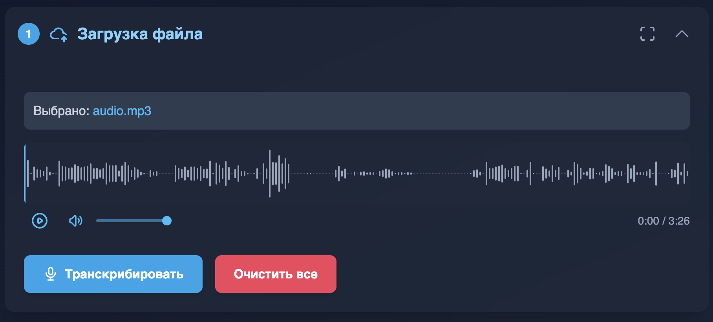

# Аудио/Видео Распознование с ИИ



Этот проект представляет собой веб-приложение для обработки аудио и видео файлов с использованием возможностей искусственного интеллекта. Оно позволяет пользователям загружать медиафайлы, транскрибировать их содержимое, автоматически определять и назначать имена дикторам, получать краткое резюме транскрипции и взаимодействовать с транскрипцией в режиме чата.

## Особенности

*   **Загрузка файлов:** Поддержка загрузки различных аудио и видео форматов.
*   **Транскрипция:** Автоматическое преобразование речи в текст с использованием Google Gemini API.
*   **Определение дикторов:** Автоматическое определение уникальных дикторов в транскрипции и возможность присвоения им имен.
*   **Редактирование транскрипции:** Имена дикторов автоматически применяются к тексту, и пользователи могут их изменять.
*   **Создание резюме:** Генерация краткого содержания на основе полной транскрипции.
*   **Интерактивный чат:** Возможность задавать вопросы и получать ответы в контексте транскрибированного текста.
*   **Адаптивный интерфейс:** Современный и удобный интерфейс, адаптирующийся под разные размеры экрана, с возможностью полноэкранного режима для каждой секции.
*   **Аудиовизуализация:** Отображение аудиоволны для загруженных файлов с возможностью управления воспроизведением.

## Запуск проекта локально

**Необходимые компоненты:**

*   Node.js (версия 18.x или выше рекомендуется)
*   pnpm (менеджер пакетов, можно установить через `npm install -g pnpm`)

**Шаги для запуска:**

1.  **Клонируйте репозиторий (если еще не сделали):
    ```bash
    git clone <URL_РЕПОЗИТОРИЯ>
    cd <НАЗВАНИЕ_ПАПКИ_ПРОЕКТА>
    ```

2.  **Установите зависимости:**
    ```bash
    pnpm install
    ```

3.  **Настройте API ключ Google Gemini:**
    Создайте файл `.env.local` в корне проекта, если он еще не существует:
    ```bash
    touch .env.local
    ```
    Откройте файл `.env.local` и добавьте в него следующую строку, заменив `ВАШ_API_КЛЮЧ` на ваш действительный API ключ от Google Gemini:
    ```env
    GEMINI_API_KEY=ВАШ_API_КЛЮЧ
    ```

4.  **Запустите приложение в режиме разработки:**
    ```bash
    pnpm dev
    ```

После этого приложение должно быть доступно по адресу `http://localhost:5173` (или другому порту, указанному в выводе консоли).

